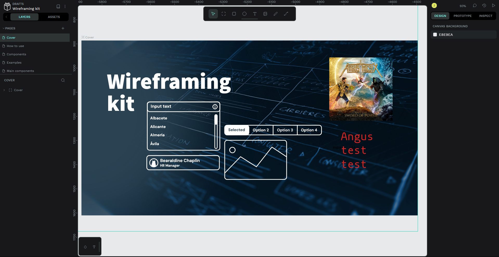

<!--
NOTA: Este README foi creado automáticamente por <https://github.com/YunoHost/apps/tree/master/tools/readme_generator>
NON debe editarse manualmente.
-->

# Penpot para YunoHost

[](https://ci-apps.yunohost.org/ci/apps/penpot/)  

[](https://install-app.yunohost.org/?app=penpot)

*[Le este README en outros idiomas.](./ALL_README.md)*

> *Este paquete permíteche instalar Penpot de xeito rápido e doado nun servidor YunoHost.*  
> *Se non usas YunoHost, le a [documentación](https://yunohost.org/install) para saber como instalalo.*

## Vista xeral

Design and prototyping platform meant for cross-domain teams. Non dependent on operating systems, web based and works with open standards (SVG). Penpot invites designers all over the world to fall in love with open source while getting developers excited about the design process in return.

**Versión proporcionada:** 2.1.3~ynh1

## Capturas de pantalla



## Documentación e recursos

- Web oficial da app: <https://penpot.app/>
- Documentación oficial para usuarias: <https://help.penpot.app/user-guide/>
- Documentación oficial para admin: <https://help.penpot.app/technical-guide/>
- Repositorio de orixe do código: <https://github.com/penpot/penpot>
- Tenda YunoHost: <https://apps.yunohost.org/app/penpot>
- Informar dun problema: <https://github.com/YunoHost-Apps/penpot_ynh/issues>

## Info de desenvolvemento

Envía a túa colaboración á [rama `testing`](https://github.com/YunoHost-Apps/penpot_ynh/tree/testing).

Para probar a rama `testing`, procede deste xeito:

```bash
sudo yunohost app install https://github.com/YunoHost-Apps/penpot_ynh/tree/testing --debug
ou
sudo yunohost app upgrade penpot -u https://github.com/YunoHost-Apps/penpot_ynh/tree/testing --debug
```

**Máis info sobre o empaquetado da app:** <https://yunohost.org/packaging_apps>
