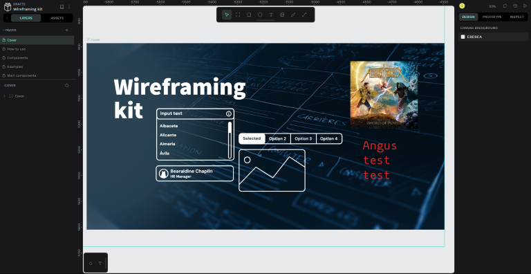

<!--
NB: Deze README is automatisch gegenereerd door <https://github.com/YunoHost/apps/tree/master/tools/readme_generator>
Hij mag NIET handmatig aangepast worden.
-->

# Penpot voor Yunohost

[](https://ci-apps.yunohost.org/ci/apps/penpot/)


[](https://install-app.yunohost.org/?app=penpot)

*[Deze README in een andere taal lezen.](./ALL_README.md)*

> *Met dit pakket kun je Penpot snel en eenvoudig op een YunoHost-server installeren.*  
> *Als je nog geen YunoHost hebt, lees dan [de installatiehandleiding](https://yunohost.org/install), om te zien hoe je 'm installeert.*

## Overzicht

Design and prototyping platform meant for cross-domain teams. Non dependent on operating systems, web based and works with open standards (SVG). Penpot invites designers all over the world to fall in love with open source while getting developers excited about the design process in return.

**Geleverde versie:** 2.4.2~ynh1

## Schermafdrukken



## Documentatie en bronnen

- Officiele website van de app: <https://penpot.app/>
- Officiele gebruikersdocumentatie: <https://help.penpot.app/user-guide/>
- Officiele beheerdersdocumentatie: <https://help.penpot.app/technical-guide/>
- Upstream app codedepot: <https://github.com/penpot/penpot>
- YunoHost-store: <https://apps.yunohost.org/app/penpot>
- Meld een bug: <https://github.com/YunoHost-Apps/penpot_ynh/issues>

## Ontwikkelaarsinformatie

Stuur je pull request alsjeblieft naar de [`testing`-branch](https://github.com/YunoHost-Apps/penpot_ynh/tree/testing).

Om de `testing`-branch uit te proberen, ga als volgt te werk:

```bash
sudo yunohost app install https://github.com/YunoHost-Apps/penpot_ynh/tree/testing --debug
of
sudo yunohost app upgrade penpot -u https://github.com/YunoHost-Apps/penpot_ynh/tree/testing --debug
```

**Verdere informatie over app-packaging:** <https://yunohost.org/packaging_apps>
